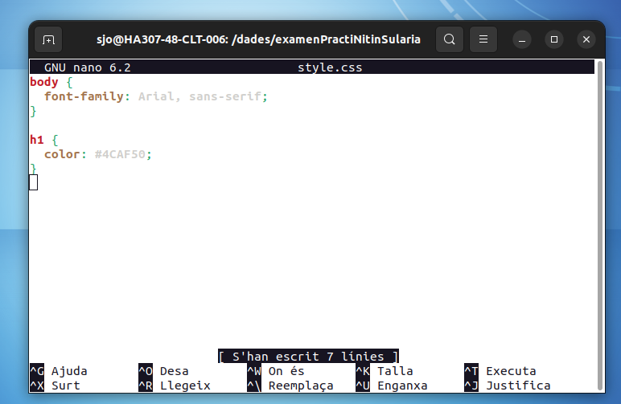
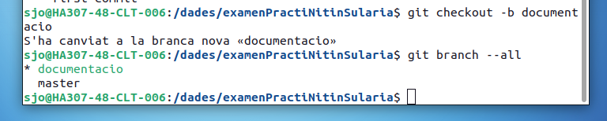
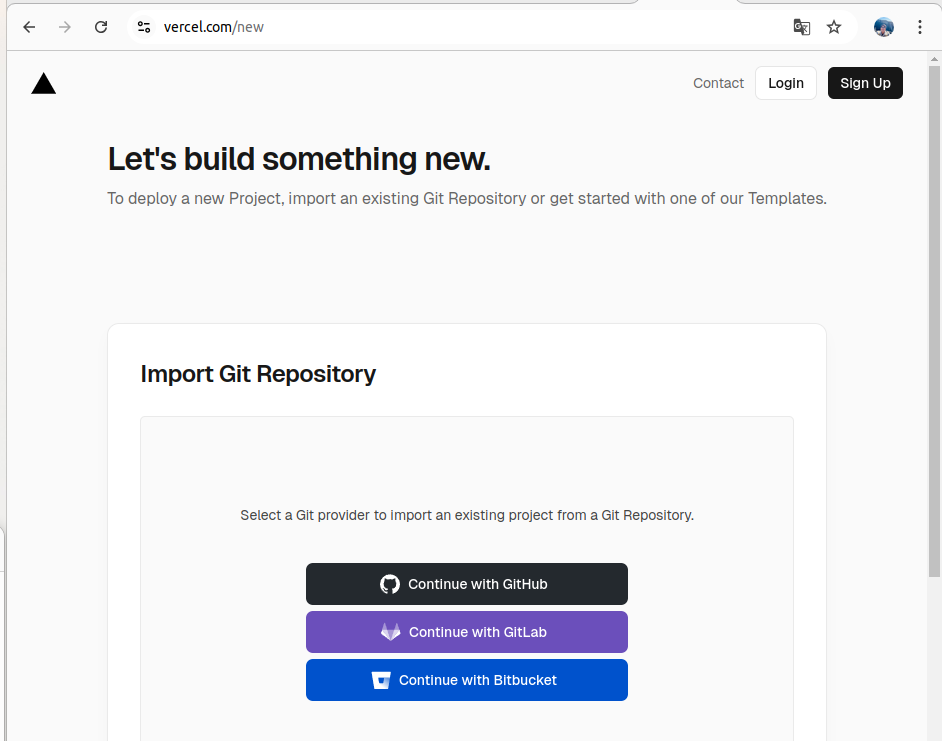

# ExamenM8

Este proyecto consiste en crear y gestionar un sitio web básico usando 
Git para el control de versiones y Vercel para publicarlo. 
El sitio web estará hecho con HTML, CSS y JavaScript.

